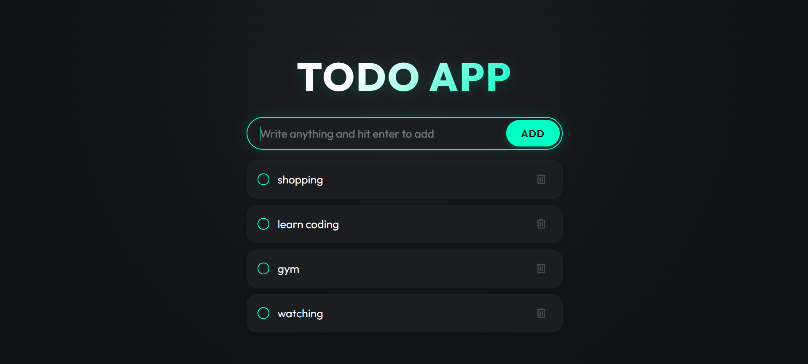

# ⚡ Todo App

A sleek, premium, and highly responsive **Todo Web App** built using HTML, CSS (Vanilla), and JavaScript. Featuring a modern dark-mode aesthetic, interactive micro-animations, and persistent local storage.

---

## 📸 Preview

---

## ✨ Features

- **Premium UI Design**: A stunning glassmorphic dark-theme design with a glowing title and soft input shadows.
- **Micro-Animations**: Ultra-smooth hover transitions, card translate offsets, scale bounces, and circular checkbox transitions.
- **Persistent State**: Leverages the browser's `localStorage` to save, update, and persist todos automatically across page reloads.
- **Smart Completion**: Interactive tasks that dim and scale down elegantly upon completion using modern CSS parent selection (`:has()`).
- **Fully Responsive**: Optimized layout that adapts gracefully from large desktop monitors down to mobile viewports.
- **Custom Scrollbar**: Customized, thin dark-themed scrollbar matching the overall application aesthetics.

---

## 🛠️ Built With

- **HTML5**: Semantic tags for structured layout.
- **CSS3 (Vanilla)**: Custom styling using CSS variables, Google Fonts (`Outfit`), transitions, flexbox, and grids.
- **JavaScript (ES6+)**: Dom manipulation, event listeners, dynamic element generation, and state management.
